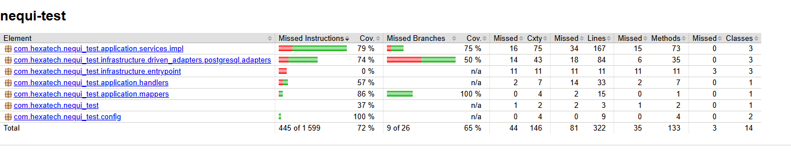

# Nequi Test Application

Este proyecto es una API REST desarrollada con **Spring Boot** para la gestión de productos, sucursales y franquicias. Incluye validaciones robustas para los datos de entrada utilizando anotaciones estándar de Jakarta Validation y mensajes personalizados.

## Características

- Gestión de productos, sucursales y franquicias.
- Validaciones personalizadas para los DTOs.
- Arquitectura basada en DTOs y buenas prácticas de Spring Boot.
- Configuración de mensajes de validación internacionalizables (i18n).

## Consideraciones en el desarrollo

- Se utilizó **Spring Boot** para la creación de la API REST.
- Se implementaron **DTOs** para la transferencia de datos entre la capa de presentación y la capa de servicio.
- Se aplicaron **validaciones** utilizando anotaciones de Jakarta Validation, con mensajes personalizados para una mejor experiencia de usuario.
- Se configuró la internacionalización (i18n) para los mensajes de validación, permitiendo una fácil adaptación a diferentes idiomas.
- Se utilizó **PostgreSQL** como base de datos, aunque la aplicación es compatible con cualquier base de datos que soporte JPA.
- Se implementaron pruebas unitarias para asegurar la calidad del código.
- Se incluyó documentación de la API utilizando **Swagger** para facilitar la comprensión y uso de la misma.
## Estructura del proyecto
Esta es la estructura del proyecto:
```
nequi-test
├── src
│   ├── main
│   │   ├── java
│   │   │   └── com
│   │   │       └── hexatech
│   │   │           └── nequi_test
│   │   │               ├── infrastructure
│   │   │               │   ├── entrypoint # Controladores REST
│   │   │               │   └── driven_adapters # Adaptadores de los puertos
│   │   │               │       └── postgresql # Implementación de repositorios
│   │   │               └── application
│   │   │               │   ├── ports # Interfaces de los puertos
│   │   │               │   └── services # Lógica de negocio
│   │   │               │   └── handlers # Manejo de excepciones
│   │   │               │   └── mappers # Conversores entre modelos y DTOs
│   │   │               │   └── dtos # Data Transfer Objects
│   │   │               └── domain
│   │   │                   ├── models # Entidades del dominio
│   │   │                   └── exceptions # Excepciones personalizadas
│   │   │               └── config # Configuraciones de la aplicación

```


## Requisitos

- Java 21 o superior
- Maven 3.8+
- (Opcional) Docker para despliegue

## Ejecución local

1. Clona el repositorio:
    ```sh
    git clone https://github.com/tu-usuario/nequi-test.git
    cd nequi-test
    ```
2. Añade las variables de entorno para la conexion con la base de datos (unicamente PostgreSQL):
    ```sh
    DB_URL= example:jdbc:postgresql://localhost:5432/nequi_test
    DB_USERNAME= tu_usuario
    DB_PASSWORD= tu_contraseña
    DB_DDL_AUTO= update # create-drop, create, validate, none
    ```
3. Compila y ejecuta la aplicación:
    ```sh
    mvn spring-boot:run
    ```
4. La API estará disponible en:  
   [http://localhost:8080](http://localhost:8080)


## Ejecución con Docker
1. Asegúrate de tener Docker instalado y en funcionamiento.
2. Ajusta las variables de entorno o argumentos segun sea necesarion en el archivo `docker-compose.yml`:
    ```yaml
    environment:
      - DB_URL=jdbc:postgresql://db:5432/nequi_test
      - DB_USERNAME=tu_usuario
      - DB_PASSWORD=tu_contraseña
      - DB_DDL_AUTO=update # create-drop, create, validate, none
    ```
3. Ejecuta el siguiente comando para levantar la aplicación:
    ```sh
    docker-compose up --build
    ```
4. La API estará disponible en:
    [http://localhost:8080](http://localhost:8080)

## Ejecución en linea
Puedes probar la API en línea usando como base la siguiente URL:

[https://nequi-test-621581734134.us-central1.run.app](https://nequi-test-621581734134.us-central1.run.app)
### Consideraciones
- La base de datos está pre-poblada con algunos datos de ejemplo.
- La API está configurada para aceptar solicitudes CORS desde cualquier origen.
- Si la aplicación tarda un poco en responder, es posible que esté iniciando debido a que se dejó un escalamiento automático. Por favor, ten paciencia.

## Documentación de la API en línea
La documentación de la API está disponible en Swagger UI:

[https://nequi-test-621581734134.us-central1.run.app/api/swagger-ui/index.html](https://nequi-test-621581734134.us-central1.run.app/api/swagger-ui/index.html)

## Cobertura de pruebas
La cobertura de pruebas se puede generar ejecutando el siguiente comando:

```sh
mvn test verify
``` 
La cobertura se generará en el directorio `target/site/jacoco`.
Actualmente, la cobertura de pruebas es del 72% como se muestra en la imagen a continuación:
